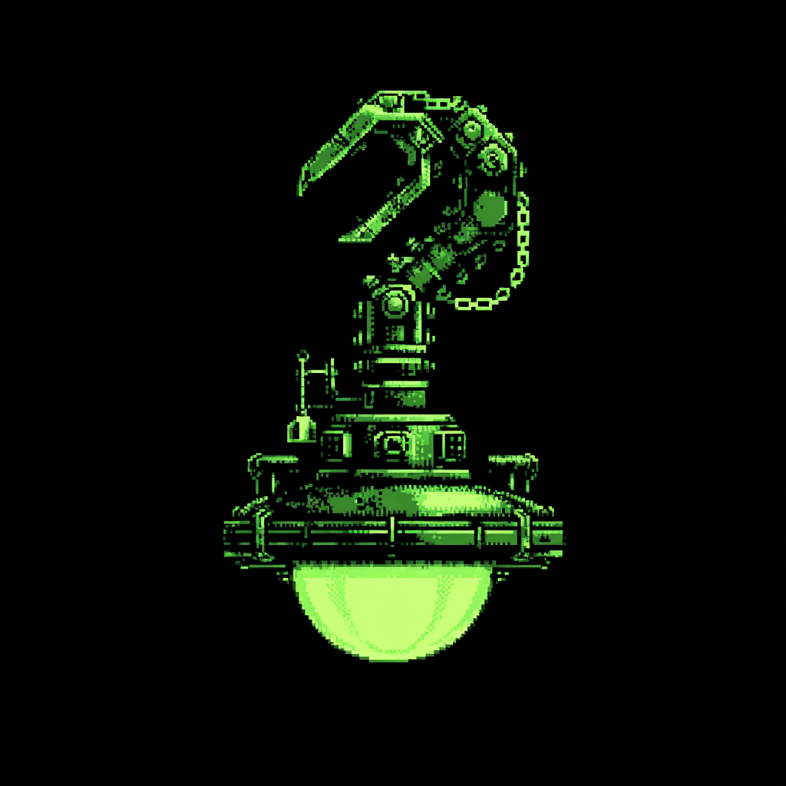

<p align="center">
  
</p>

# PeriClaw

Native Rust desktop app — a pixel-art "Agent Office" visualization of an OpenClaw AI agent farm. Lobster sprites in themed rooms, thought bubbles on state transitions, and a real-time WebSocket connection to the OpenClaw gateway.

> **Status:** in active personal use. Live WebSocket connection with Ed25519 device pairing, pixel-art office scene with sprite animations, multi-agent chat, Agents / Sessions / Logs nav tabs, approval flow, operator-driven cron runs and session resets. Persistent UI state across restarts.

## Stack

- **Framework:** [Iced 0.14](https://iced.rs) — declarative/Elm-style, `wgpu`-rendered
- **Async runtime:** tokio (via Iced's `tokio` feature)
- **Color conversion:** `palette` (OKLCH source of truth → sRGB for Iced)
- **Logging:** `tracing` + `tracing-subscriber`

## Run

```bash
./dev run                        # auto mode, debug build (uses env vars as-is)
./dev run --mode demo            # scripted fixture (offline, no gateway needed)
./dev demo-smoke                 # demo visual-QA checklist + scripted fixture
./dev run --mode ws              # real data via native WebSocket
./dev run --release              # release-optimized
./dev build --release            # stripped release binary at target/release/periclaw
./dev test                       # cargo test
./dev lint                       # cargo clippy -- -D warnings
./dev fmt                        # cargo fmt (--check for dry-run)
./dev ci                         # full CI pipeline locally (fmt + clippy + test + release build)
./dev cross-arm64                # cross-compile for aarch64-unknown-linux-gnu
./dev version                    # app version, build number, git sha
./dev help                       # usage
```

Activity implementations are thin scripts under `Scripts/`.

### Data source modes

Two paths to OpenClaw state, selected via `./dev run --mode`:

| Mode | Env vars | Data source | Use case |
|---|---|---|---|
| `demo` | `PERICLAW_MODE=demo` + `PERICLAW_DEMO=1` (auto-set) | `assets/test/scenario_happy.json` | Offline demo, UI iteration — no gateway required |
| `ws` | `OPENCLAW_GATEWAY_URL` (required), `OPENCLAW_TOKEN` (optional) | Native WebSocket to the gateway | Full push-event stream; Ed25519 device pairing handled automatically — first run files a pair-request the operator approves with `openclaw devices approve <id>`. |

`--mode demo` and `--mode ws` set `PERICLAW_MODE`, which overrides the persisted Settings-tab mode for that launch. `auto` (the default when `--mode` is omitted) picks `demo` if `PERICLAW_DEMO` is already set in the environment, otherwise `ws`. The legacy `OPENCLAW_MOCK` env var and `--mode mock` CLI alias are still accepted for older local scripts. The selector lives in `app::App::subscription`.

The demo loop intentionally covers three UI signal paths every cycle: background job work that bubbles on and off, a visible tool/message turn, and a silent lifecycle turn where the power-up shows without a thought bubble. Use `./dev demo-smoke` for the repeatable visual pass; the silent sparkle window starts around 14s and runs without a competing bubble.

## Build for release

```bash
./dev build --release      # local target (macOS/Linux) — target/release/periclaw
./dev cross-arm64          # aarch64-unknown-linux-gnu (uses `cross` if available)
```

The release build strips debug symbols automatically. Build numbers come from `Scripts/get-build-number.sh` (git commit count, overridable with `BUILD_NUMBER` env var) so CI and local stay aligned.

## Module layout

```
src/
├── main.rs             # iced::application entry — loads UiState, sets window
├── app.rs              # App state, Message enum, update, view, subscription
├── config.rs           # Gateway URL + token lookup (env → file → keychain → ~/.openclaw)
├── device_identity.rs  # Ed25519 keypair + signed connect challenge
├── ui_state.rs         # Persistent UI state (selected tab/agent/session, window size)
├── logs.rs             # Severity classification + log buffer for the Logs tab
├── domain/             # Agent, status, room assignment
├── scene/              # Canvas program, sprite atlas, thought bubbles
├── net/                # WS client (openclaw.rs), commands, events, rpc types, demo
└── ui/                 # Per-tab views, shared widgets (chat_bubble, chat_input,
                        # sidebar, status_bar, approvals) and OKLCH theme
```

## Configuration

**Gateway URL**: set `OPENCLAW_GATEWAY_URL` to a `ws://` or `wss://` endpoint. There is no default — if the var is unset and `--mode demo` is not selected, the app surfaces an error and stays disconnected.

The WebSocket handshake sends an `Origin` header derived from the gateway URL's scheme and host (`wss://host/...` → `https://host`). The gateway's `controlUi.allowedOrigins` setting must include this origin, or the upgrade will be rejected.

**Device pairing**: Ed25519 keypair generated on first run and stored in both `$XDG_CONFIG_HOME/periclaw/device-key` (mode 0600) and the OS keychain (macOS Keychain / Linux Secret Service / Windows Credential Manager). The client signs a challenge during the gateway `connect` handshake; scope upgrades file a pair-request the operator approves with `openclaw devices approve <id>`.

**Token lookup** (for endpoints that require a bearer token), in order:

1. `OPENCLAW_TOKEN` env var.
2. `$XDG_CONFIG_HOME/periclaw/gateway-token` (chmod 0600) — the on-disk fallback written by the app itself.
3. OS keychain — legacy read-only path, kept so installs from older builds keep working.
4. Bootstrap from `~/.openclaw/openclaw.json` → `auth.token`, then mirror into (2).

Writes land on the plaintext file, not the keychain — on macOS dev builds the binary signature changes each `cargo run`, which triggers a login-password prompt every launch when writing to the keychain. See `src/config.rs` for the full resolution flow.

## Platform notes

- **macOS:** ships with Metal via `wgpu`. No notarization needed for personal use.
- **Linux:** requires `libxkbcommon-dev libwayland-dev libfontconfig1-dev libssl-dev mesa-vulkan-drivers`. Prefer Wayland over X11.
